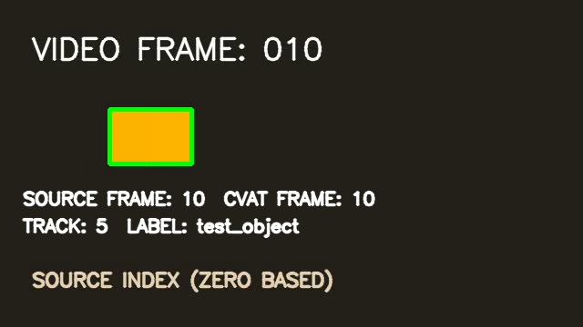

# CVAT Video Annotation API Mini Test



**One video · two CVAT tasks · 35 passing checks · zero observed frame shifts**

This repository runs a small, reproducible video annotation experiment against a local CVAT server. Python creates a numbered MP4, uploads it as a CVAT task, writes one rectangle track through the annotation API, exports CVAT video XML, imports it into a clean task, and checks the round trip against live CVAT responses.

The recorded run used CVAT 2.76.0 and passed. See the [experiment report](reports/CVAT_MINI_TEST_REPORT.md) and [machine-readable results](sample/output/test_summary.json).

## Explore the visual showcase

The five-page [showcase](docs/index.html) explains the workflow, lets you switch between source and annotated frames, displays all 35 validation checks, and gives reproduction steps. Preview it locally from this repository:

```powershell
python -m http.server 8000 -d docs
```

Open **http://localhost:8000** in your browser. The site is static and uses checked-in results from the real CVAT run; visitors do not need a running CVAT server. After a new passing run, `python scripts/run_demo.py` regenerates the evidence images and site data. You can also rebuild the site from existing passing outputs with `python scripts/build_site.py`.

## What it demonstrates

- Authenticated task and media creation through the CVAT Python SDK (which calls the REST API)
- Live task, job, label, frame metadata, and annotation retrieval
- A 17-shape video track: visible frames 5–20 and an `outside` shape at 21
- Asynchronous export/import polling with a 600-second deadline
- XML parsing, re-import into a second task, and coordinate/flag comparison
- Frame mapping checked by comparing CVAT-served frame images with decoded source video frames

## Requirements and CVAT setup

Python 3.10, Docker Desktop with the Linux engine, and Docker Compose were used on Windows 11. The same scripts use portable paths and can run on Linux or macOS with a local CVAT instance. The SDK version is pinned to the server's major/minor version.

Start Docker Desktop. The run behind this repository used CVAT's [official installation workflow](https://docs.cvat.ai/docs/administration/community/basics/installation/) with a separate checkout:

```powershell
git clone --depth 1 --branch v2.76.0 https://github.com/cvat-ai/cvat.git ../cvat-upstream-v2.76.0
cd ../cvat-upstream-v2.76.0
docker compose up -d
docker exec -it cvat_server python3 /opt/cvat/manage.py createsuperuser
```

The last command creates a local administrator account. This run automated that one-time account creation locally; the command above is the supported interactive equivalent for a fresh clone. CVAT is available at `http://localhost:8080`; the live API schema is at `http://localhost:8080/api/schema/`. Leave unrelated Compose projects running. The CVAT checkout and its Docker data stay outside this mini-test repository.

## Install and configure

From this repository:

```powershell
python -m venv .venv
.venv\Scripts\Activate.ps1
python -m pip install -r requirements.txt
Copy-Item .env.example .env
```

On Linux or macOS, activate with `source .venv/bin/activate` and copy the file with `cp .env.example .env`. Set `CVAT_USERNAME` and `CVAT_PASSWORD` in `.env`, or set `CVAT_TOKEN` to a personal access token supported by your server. Credentials are local and `.env` is ignored by Git. `CVAT_BASE_URL` defaults to `http://localhost:8080`; set `CVAT_ORGANIZATION` only when needed.

## Run

```powershell
python scripts/run_demo.py
```

The orchestrator calls these independently usable steps in order:

```powershell
python scripts/generate_test_video.py
python scripts/create_task.py
python scripts/upload_annotations.py
python scripts/export_annotations.py
python scripts/reimport_annotations.py
python scripts/validate_alignment.py
python scripts/generate_visual_evidence.py
python scripts/build_site.py
```

`run_demo.py` creates two new tasks on each run and records their IDs in `sample/output/run_state.json`. It does not delete previous tasks. The validation command exits 0 only when all checks pass, otherwise 1. It reads both tasks again from CVAT and generates a fresh round-trip export, so a cached success file cannot make it pass.

## Frame indexing and evidence

The encoded video has 60 frames at 10 FPS, 640×360, and a visible zero-based `VIDEO FRAME: NNN` label. OpenCV, CVAT's frame API, track annotation frame values, exported XML, and imported annotation frame values all matched zero-based source indices for frames 5, 10, and 20 in the recorded run. The job spans frames 0–59. No claim is made about a UI display offset; the UI was not needed for the experiment.

CVAT names the export format `CVAT for video 1.1` and the matching import format `CVAT 1.1`. Track IDs are assigned or renumbered by CVAT, so the validator compares geometry and timing rather than assuming stable IDs.

- [Frame 5 evidence](sample/output/evidence_frame_005.jpg), [frame 10 evidence](sample/output/evidence_frame_010.jpg), [frame 20 evidence](sample/output/evidence_frame_020.jpg)
- [Source CVAT XML](sample/output/source_annotations.xml), [round-trip CVAT XML](sample/output/round_trip_annotations.xml)
- [Source API response](sample/output/source_annotations_api.json), [round-trip API response](sample/output/round_trip_annotations_api.json)
- [Validation summary](sample/output/test_summary.json)

The JPEGs overlay boxes retrieved from the round-trip task on decoded source frames. The checked-in MP4 is 121 KB; the XML, ZIP, and JSON evidence files are small.

## Repository layout

`scripts/common.py` holds configuration, geometry, API connection, bounded background polling, and export parsing. Each named step has a corresponding script in `scripts/`. `sample/input/` contains the video; `sample/output/` contains CVAT outputs and evidence; `docs/` contains the static showcase; `reports/` contains the engineering report.

## Troubleshooting

- **CVAT unavailable or 502:** ensure Docker Desktop's Linux engine is running; `docker compose ps` from the CVAT checkout shows startup status. The server can briefly return 502 while migrations finish.
- **Authentication failed:** check `.env` credentials or token and confirm the local account exists.
- **Port 8080 occupied:** inspect the service using that port before changing CVAT's Compose configuration.
- **Background request timeout:** inspect CVAT worker logs and the request status in CVAT; the scripts stop after 600 seconds rather than waiting forever.
- **Video ingestion or codec error:** regenerate the MP4 and confirm OpenCV reopens it; the generator verifies metadata after encoding.
- **Format missing:** query `/api/server/annotation/formats` on the running version. The script checks both export and import names.

No CVAT database, Docker volume, credential, or local checkout is part of this repository.
