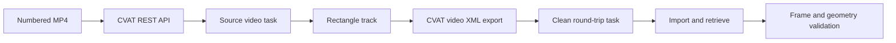

# CVAT Mini Test Report

## Objective

Demonstrate and verify a programmatic video annotation workflow with local CVAT. The work uses Python and CVAT's REST-backed SDK for task creation, media upload, annotation upload, export, re-import, and validation. The CVAT labeling UI was not used to create annotations.

## Architecture

## Environment

| Component | Verified value |
| --- | --- |
| Operating system | Microsoft Windows 11 Pro, build 10.0.26200 |
| Python | 3.10.10 |
| Docker Engine / CLI | 29.4.1 |
| Docker Compose | v5.1.3 |
| CVAT | 2.76.0, returned by `/api/server/about` |
| API schema | OpenAPI 3.0.3; CVAT REST API `2.76.0 (2.0)` at `/api/schema/` |
| URL | `http://localhost:8080` |
| Authentication | Local username/password through CVAT SDK login |
| Export / import names | `CVAT for video 1.1` / `CVAT 1.1` |

CVAT was started with `docker compose up -d` from an official v2.76.0 checkout kept beside this repository. Docker Desktop's Linux engine was used. A local admin account was created in CVAT; its password remains in the ignored `.env` file.

## Test video

`sample/input/synthetic_tracking.mp4` was generated with OpenCV's `mp4v` encoder and then reopened. The encoded file reports 60 frames, 10 FPS, 640×360, and 6.0 seconds. Each frame visibly reads `VIDEO FRAME: NNN`, where `NNN` is the zero-based source index. The orange rectangle is `(x, y, width, height) = (80 + 4 × frame, 120, 90, 60)`.

## CVAT APIs and workflow

The endpoints below were checked against the running server's schema. The SDK handled multipart upload/download and session authentication; it polled background requests with an added 600-second deadline.

| Endpoint | Use |
| --- | --- |
| `POST /api/auth/login` | Authenticate the local account |
| `GET /api/server/about`, `GET /api/server/annotation/formats` | Verify version and available formats |
| `POST /api/tasks`, `POST /api/tasks/{id}/data/` | Create a labeled task and upload MP4 |
| `GET /api/requests/{id}` | Poll ingestion, export, and import requests |
| `GET /api/tasks/{id}`, `GET /api/tasks/{id}/data/meta`, `GET /api/jobs` | Inspect task, frame, and job metadata |
| `PUT /api/tasks/{id}/annotations/`, `GET /api/tasks/{id}/annotations/` | Write and retrieve track annotations |
| `POST /api/tasks/{id}/dataset/export` | Export CVAT video annotations |
| `POST /api/tasks/{id}/annotations/` | Import the export into the clean task |

The final full-run source task is ID **4**, job **4**, label ID **4**. Its media metadata contains 60 frames of 640×360, and its job spans 0–59. The clean round-trip task is ID **5**, job **5**, label ID **5**, with the same media metadata.

## Annotation model and format

The `test_object` label has one rectangle track. All frames 5–20 have explicit visible track shapes; frame 21 has an `outside=true` shape to end visibility. No shape is occluded. For frame `f`, the expected CVAT points are `[80 + 4f, 120, 170 + 4f, 180]`. Providing every visible frame as a shape avoids relying on interpolation for this alignment experiment.

The native annotation API returned one track with 17 shapes. The API response does not expose a `keyframe` field for each track shape in this version. The CVAT-generated video XML does: all 17 `<box>` elements have `keyframe="1"`, and the last has `outside="1"`. The XML root includes `<version>1.1</version>`, task metadata, label metadata, and `<track>` with frame-numbered boxes. Its ZIP export also contains the XML. CVAT assigned track ID 4 in the source API, wrote ID 0 in the export, and assigned ID 5 after import; IDs are therefore not a round-trip identity key.

## Frame indexing investigation

| Boundary | Observed indexing | Evidence |
| --- | --- | --- |
| OpenCV / source MP4 | Zero based, 0–59 | Decoded frame count and `CAP_PROP_POS_FRAMES` reads |
| Burned frame identifier | Zero based | Generator writes `VIDEO FRAME: 005`, `010`, `020` on those source frames |
| CVAT task/job metadata | Zero based, 0–59 | Job `start_frame=0`, `stop_frame=59`; task size 60 |
| CVAT served frame API | Same source index | CVAT frames 5, 10, 20 each had the lowest image error against source frames 5, 10, 20 respectively |
| Source annotation API | Zero based | Track shapes at 5–20, outside at 21 |
| Exported CVAT XML | Same frame values | XML `<box frame>` values 5–21 |
| Imported annotation API | Same frame values | Round-trip track shapes at 5–21 |
| Evidence JPEGs | Same source index | Burned label and imported box at 5, 10, 20 |

The image comparison used all 60 source frames for each of the three CVAT-served frames. The closest source indices were exactly 5, 10, and 20 (mean squared errors 0.0759, 0.0761, and 0.0600 after resizing). No frame offset was observed at these API/export/import boundaries. UI display numbering was not tested, so no UI offset is asserted.

## Round-trip validation

CVAT exported the source task as `CVAT for video 1.1`; the archive was imported with the server-advertised `CVAT 1.1` importer into task 5. Both tasks were queried again. The validator compared label identity by name, track count, ordered frame IDs, rectangle coordinates, outside/occlusion flags, and each task's media and job metadata. It also exported task 5 and confirmed its XML keyframe and box data matched the source export.

## Validation results

The final `python scripts/validate_alignment.py` run exited **0** and wrote `FINAL RESULT: PASS`.

| Check | Result |
| --- | --- |
| Encoded video frame count, FPS, resolution, duration | PASS |
| Source and round-trip task/job/label/media metadata | PASS |
| Source track coordinates and outside boundary | PASS |
| Frame 5, 10, and 20 API-to-source mapping | PASS |
| Source XML parsing, frame IDs, coordinates, keyframes | PASS |
| Round-trip import and annotation retrieval | PASS |
| Round-trip frame IDs and coordinates | PASS |
| Round-trip XML keyframes and boxes | PASS |

The detailed check booleans and task IDs are in [`test_summary.json`](../sample/output/test_summary.json).

## Visual evidence

The JPEGs overlay annotations retrieved from the imported CVAT task onto decoded source frames: [frame 5](../sample/output/evidence_frame_005.jpg), [frame 10](../sample/output/evidence_frame_010.jpg), and [frame 20](../sample/output/evidence_frame_020.jpg). Each image shows the burned frame ID, the matching CVAT frame ID, track ID, label, and green box. The raw [source XML](../sample/output/source_annotations.xml) and [round-trip XML](../sample/output/round_trip_annotations.xml) are included for inspection.

## Problems encountered

- Docker Desktop was initially stopped. Starting its Linux engine allowed CVAT's official Compose stack to run without changing the unrelated CRM containers.
- The CVAT proxy briefly returned 502 while the server applied migrations. `/api/server/about` later returned version 2.76.0.
- The live format list named export `CVAT for video 1.1` and import `CVAT 1.1`. The scripts use these separately.
- CVAT changed the track ID across API/export/import. Validation uses track geometry and timing, which remained stable.
- CVAT operations were asynchronous. The SDK's default waiter has no deadline, so the project supplies a bounded request-status poller.
- A second full run found that the SDK refuses to overwrite an existing export ZIP. The exporter now downloads to a temporary path and replaces only its own prior artifact; run-state IDs prevent stale exports from being validated.

## Final result

**PASS.** The actual local CVAT server accepted the MP4 and track, exported XML, imported it into a clean task, and returned matching annotations and frame images. The final validator result comes from live server reads and both CVAT-generated exports.

## Limitations

This is a local, single-user synthetic-video test with one label and one rectangle track. It does not measure throughput or exercise production authentication, multiple jobs, or UI numbering.
